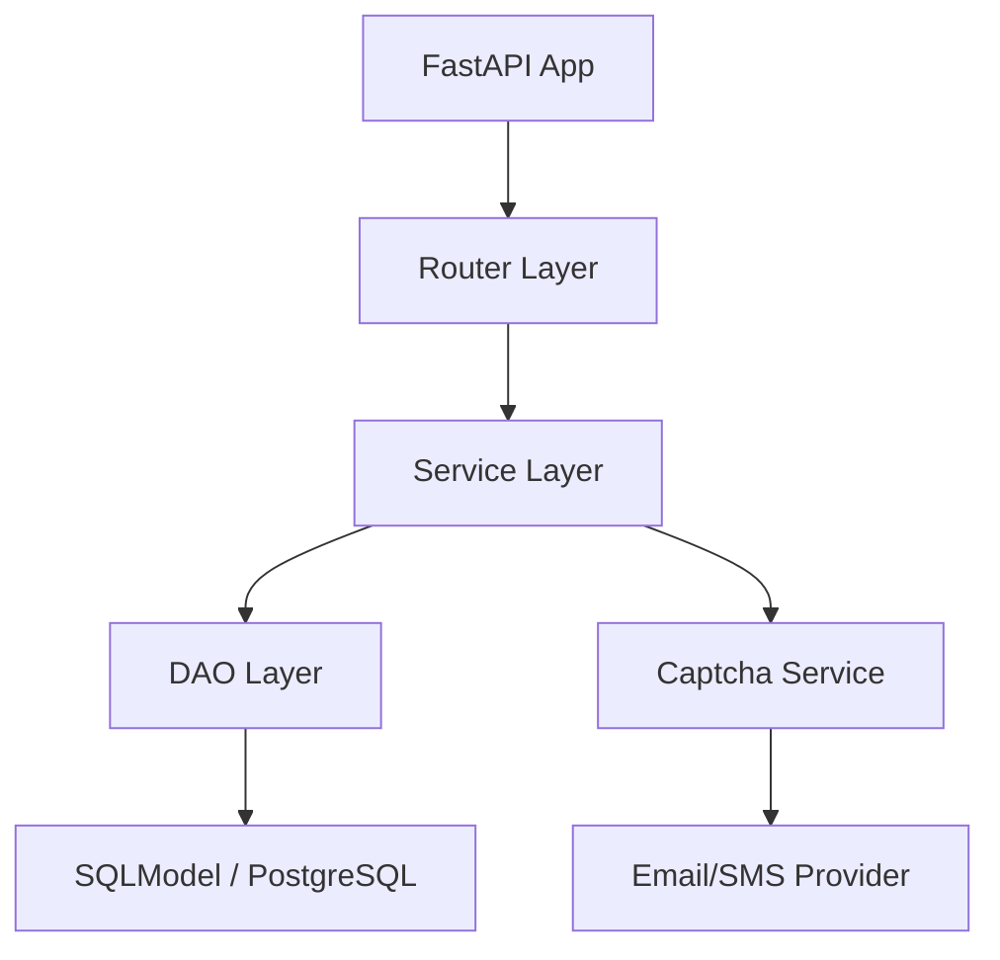

# **Beany · FastAPI Demo**   

一个现代化、结构清晰、**可扩展的 FastAPI 后端工程模板**。
开箱即用 **用户登录、验证码发送、PostgreSQL、异步 ORM、全局异常处理、依赖注入** 等核心能力。

> 🎯 目标：帮助开发者快速搭建生产级 FastAPI 后端
> ⭐ Star / Fork 一起完善生态！

---

## ✨ **核心亮点**

### 🚀 100% 异步架构

* **FastAPI + SQLModel + AsyncSession + PostgreSQL**
* 支持高并发 & 异步 I/O，性能卓越

### 🏗 企业级项目结构

* 清晰分层：`router / service / dao / model / common / store / util`
* 团队协作与扩展无压力

### 🔐 开箱即用权限体系

* JWT 鉴权 + OAuth2 token 流程
* 用户登录 / 自动注册
* 验证码登录（邮箱 / 手机）

### 📡 完整验证码系统

* 支持邮箱 / SMS
* 发送记录入库
* 校验、过期、重复使用防护
* Jinja2 HTML 邮件模板渲染

### 🧩 稳健全局异常处理

* 统一 ResponseModel
* 业务错误、Pydantic 校验错误、全局异常统一处理

### 🔧 高可维护 DAO 层

* 通用 BaseDao：增删改查可复用
* 每个 model dao 只需少量业务方法

### 📨 SMTP 邮件发送（异步）

* aiosmtplib + Jinja2
* 可扩展生产环境使用

---

## 🏛️ **项目结构概览**



```
beany-fastapi-async
├── common        # 配置、异常、依赖注入
├── dao           # 数据访问层（BaseDao + 各模块Dao）
├── model         # SQLModel 模型、请求体
├── service       # 业务逻辑层
├── router        # API 路由模块
├── store         # 数据库连接、基础模型
├── templates     # Jinja2 邮件模板
├── util          # 工具函数（token、验证码等）
├── main.py       # 应用入口
├── pyproject.toml
└── README.md
```

---

## 🚀 **快速启动**

### 1️⃣ 安装 uv

```bash
pip install uv
```

### 2️⃣ 初始化项目

```bash
uv sync
```

### 3️⃣ 配置环境变量

```bash
cp .env.example .env
```

### 4️⃣ 启动开发环境

```bash
uv run uvicorn main:app --reload
```

* 访问自动生成 API 文档： [http://127.0.0.1:8000/docs](http://127.0.0.1:8000/docs)

---

## 🧪 **API 示例**

### 登录（验证码登录）

```http
POST /api/v1/user/login
Content-Type: application/json

{
  "account": "email@example.com",
  "code": "123456"
}
```

### 发送验证码

```http
POST /api/v1/captcha/send_code
Content-Type: application/json

{
  "account": "email@example.com"
}
```

### 获取当前用户信息

```http
GET /api/v1/user/me
Authorization: Bearer <token>
```

---

## 🧬 **技术栈**

| 技术         | 说明                        |
| ---------- | ------------------------- |
| FastAPI    | 高性能 Python Web 框架         |
| SQLModel   | Pydantic + SQLAlchemy ORM |
| asyncpg    | PostgreSQL 异步驱动           |
| aiosmtplib | 异步邮件发送                    |
| Jinja2     | 邮件模板渲染                    |
| PyJWT      | JWT Token 管理              |
| uv         | Python 项目管理 & 命令工具        |

---

## 🌱 **适合人群**

* 快速搭建 **生产级 FastAPI 后端** 的开发者
* 学习 **项目结构最佳实践**
* 构建登录 / 验证码系统的 Web / App 项目
* 想要一个优雅、可扩展的 **开源模板**

---

## 🤝 **参与贡献**

* Fork / Star / PR 一起完善模板
* 讨论和反馈请打开 GitHub Discussions
* **Star ⭐ 是对项目最大的支持！**

---

## 📄 License

MIT License

---